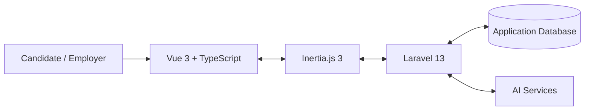

# FLOW

### AI-Powered Career Platform for Job Seekers and Employers

FLOW is a project I started developing in March 2026. My main idea was to build one platform that could be useful for both sides of the hiring process: people looking for a job and employers looking for candidates.

The platform has two connected parts:

- **JobFlow** — for job seekers. It includes resumes, job search, applications, job matching, interview practice, salary tools, development resources, and account settings.
- **HRFlow** — for employers. It includes vacancy management, candidate applications, communication, and interview scheduling.

The current interface is in **English**.

## Why I Built FLOW

When I started working on this project, I noticed that many career platforms solve only one part of the problem. A person may need one website for a resume, another one for vacancies, another one for interview preparation, and a separate system for tracking applications.

I wanted to connect these steps in one place and make the process easier to understand. The main goal of FLOW is not to replace a recruiter or make decisions instead of a person. It is meant to organize information, show useful comparisons, and help users prepare better.

## JobFlow — Candidate Side

### Dashboard

The dashboard gives the user a quick overview of their activity and provides shortcuts to the main parts of the platform.

### Resume Management

A user can create several resumes, rename them, duplicate them, delete them, and choose one resume as the **Primary Resume**. The Primary Resume is used as the default resume for job matching.

The structured resume editor supports:

- personal and contact information;
- work experience;
- education;
- skills;
- projects;
- volunteer and community experience;
- leadership and extracurricular activities;
- publications;
- awards and honors;
- languages;
- certifications;
- interests;
- additional information.

Resume items can also be included, excluded, and reordered for different resume versions.

### AI Resume Assistant

The AI Resume Assistant helps the user improve a selected resume through a conversation. It asks questions and can save answers into the correct resume sections through controlled tools.

Each resume has its own context, so the assistant works with the selected resume instead of mixing information from different versions.

### AI Resume Analysis

The platform can analyze a saved resume and return:

- strengths;
- weaknesses;
- practical recommendations;
- suggestions for a professional summary.

### AI Resume Scoring

A user can compare a resume with a job description. The system returns structured feedback and a score showing how well the resume fits the supplied description.

## Job Selection

The Job Selection page shows published vacancies stored in the platform database.

Users can filter jobs by:

- keyword;
- company;
- industry;
- position level;
- employment type;
- location;
- work arrangement;
- minimum and maximum salary;
- date posted.

There are also three views:

- **All Jobs**;
- **Saved**;
- **Applied**.

Vacancies can be sorted by newest first or by salary.

### Saved Jobs

Users can save and unsave vacancies. The saved state is stored separately for each authenticated user.

### Job Match

The platform compares a vacancy with the user's Primary Resume.

The current matching system uses four main criteria:

| Criterion | Weight |
|---|---:|
| Skills | 45% |
| Role relevance | 30% |
| Experience | 15% |
| Education | 10% |

The system checks skills against structured vacancy technologies when they are available. It also normalizes some common skill-name differences, for example `Python Programming` and `Python`.

Role relevance compares the vacancy title with role-related information from the resume.

Experience can include not only formal work experience, but also relevant projects, leadership activities, and volunteer experience. This is important for students and young applicants who may already have useful experience even if they have not had a full-time job yet.

Education is included only when the employer actually specifies an education requirement. If the vacancy does not mention education, the interface shows **N/A** instead of treating it as a mismatch.

The user can open **Why this matches** and see separate scores for each criterion. I wanted the result to be understandable instead of showing only one unexplained percentage.

## Applications and Tracker

A candidate can open a vacancy and apply using one of their own resumes.

The platform also includes an Application Tracker where users can see submitted applications, dates, and current statuses.

## Candidate–Employer Chat

Candidates and employers can communicate through an authenticated chat connected to a job application.

## AI Interview Practice

The interview section lets a user practice interviews using a selected resume and, if needed, a vacancy as context.

The workflow can include:

- AI-generated questions;
- voice-answer transcription;
- feedback;
- audio responses;
- saved interview sessions;
- final results and evaluation.

The current system evaluates the information in the answer. It is not a biometric or psychological assessment and does not claim to measure a person's personality from their voice.

## Salary and Development

JobFlow also has a Salary section with resume salary analysis support and a Development section with curated learning resources.

## Support and Account Settings

The Support Center gives users direct access to real account settings:

- Change password;
- Two-factor authentication;
- Profile settings;
- Appearance.

I intentionally did not add a fake support-ticket form because there is no real support backend for it yet.

## HRFlow — Employer Side

HRFlow is the employer part of FLOW.

At the current stage, employers can:

- create vacancies;
- view vacancies;
- edit vacancies;
- delete vacancies;
- review candidate applications;
- update application status;
- schedule interviews;
- remove interview schedules;
- communicate with candidates through chat.

Employer routes are protected separately from candidate routes.

HRFlow is still developing. Features such as onboarding, training, performance management, workforce analytics, and retention are future ideas and are not presented as finished functions.

## AI in the Project

FLOW uses Laravel AI integration for several AI-assisted features.

The main AI workflows are:

- **Resume Assistant** — helps collect and improve resume information;
- **Resume Analysis** — gives feedback on a saved resume;
- **Resume Scoring** — compares a resume with a job description;
- **Resume Salary Analysis** — supports salary-related analysis;
- **Interview workflows** — generate questions, process answers, and give feedback.

AI requests are handled on the server, so provider credentials are not exposed to the browser.

The Job Match system is separate from the generative AI features. I chose this because I wanted the matching logic to be more transparent and easier to test.

## Technical Architecture

FLOW is built as a **modular monolithic web application**. Different parts of the platform are separated by controllers, services, models, routes, and Vue pages, but the project is still deployed as one application.



### Main Technologies

- **Backend:** PHP 8.4, Laravel 13, Laravel Fortify, Laravel AI, Laravel Wayfinder, Eloquent ORM, Spatie Laravel Permission.
- **Frontend:** Vue 3.5, TypeScript, Inertia.js 3, Tailwind CSS 4, Reka UI, Lucide icons, VueUse.
- **Build tools:** Vite 8, npm, Composer.
- **Database:** configured through environment settings; SQLite is supported for local development.
- **Deployment:** Docker-based deployment on a VPS.
- **Testing and code quality:** Pest, Laravel Pint, ESLint, Prettier, Vue TypeScript checks, and Playwright tooling.

## Security

Some important security rules in the project are:

- candidate and employer routes use different role protection;
- users can only apply with resumes that belong to their own account;
- saved jobs and applications are connected to the authenticated user;
- employer application routes use scoped bindings so an application cannot be opened through the wrong vacancy;
- password changes use the existing Laravel/Fortify security workflow;
- two-factor authentication and recovery codes are available in Security settings;
- AI provider credentials stay on the server.

## Project Structure

```text
app/Ai/                       AI agents and controlled tools
app/Http/Controllers/         Candidate and shared application workflows
app/Http/Controllers/Employer Employer workflows
app/Http/Requests/            Request validation
app/Models/                   Database models and relationships
app/Services/                 Matching and domain logic
database/migrations/          Database schema
resources/js/components/      Shared Vue components
resources/js/pages/           Candidate, employer, settings and support pages
routes/                       Application and settings routes
tests/                        Pest and feature tests
```

## Current Limitations

I think it is important to show clearly what is finished and what is still being developed.

- HRFlow currently focuses on recruitment and is not a complete HR information system.
- Job Match is an explainable matching model, but it is not a perfect prediction of whether a person will get a job.
- Interview evaluation is based on the available answer content and is not a psychological assessment.
- Development resources are curated and are not automatically searched or verified by AI.
- External calendar synchronization is not presented as implemented unless it is actually connected and tested.
- The Support Center links to real settings, but there is no support-ticket system yet.
- The interface is currently English-only.

## Testing

The project includes backend and frontend tests and code-quality checks.

Useful commands include:

```bash
composer test
npm run lint:check
npm run format:check
npm run types:check
npm run build
npm run test:e2e
```

I also test important changes on the VPS before merging them into the main branch.

## What I Want to Improve Next

My next priorities are:

1. continue improving Job Match and testing it with more real resume/vacancy combinations;
2. develop HRFlow beyond the recruitment stage;
3. add more automated tests for important user flows;
4. improve scheduling and calendar functions;
5. continue working on privacy, backups, accessibility, monitoring, and recovery.

## Project Information

**Project:** FLOW  
**Candidate module:** JobFlow  
**Employer module:** HRFlow  
**Development started:** March 2026  
**Current UI language:** English  
**Repository:** `diana-radchenko/JobFlow`
