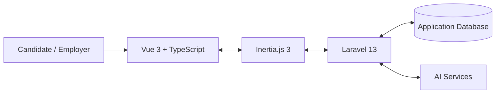

# FLOW

### AI-Powered Career Platform for Job Seekers and Employers

**FLOW** is a career-technology platform that brings job-seeker tools and employer recruitment workflows into one product. The platform currently contains two connected entry points:

- **JobFlow** — the candidate workspace for resumes, vacancy discovery, applications, job matching, interview preparation, salary tools, development resources, and account management.
- **HRFlow** — the employer workspace for publishing vacancies, reviewing candidates, managing application status, communicating with applicants, and scheduling interviews.

Development began in March 2026. The current implementation is built as one Laravel/Vue application with role-based candidate and employer experiences.

> Current interface language: **English**.

## Current Functionality

### Candidate / JobFlow

| Area | Current implementation |
|---|---|
| **Dashboard** | Candidate overview built from stored application and interview data, with quick access to the main JobFlow workflows. |
| **Resume management** | Create, rename, duplicate, delete, and select a **Primary Resume**. The primary resume is used as the default context for vacancy matching. |
| **Structured Resume Editor** | Stores contact information, work experience, education, skills, projects, volunteer/community experience, leadership and extracurricular activities, publications, awards and honors, languages, certifications, interests, and additional information. Resume items can be included/excluded and reordered per resume. |
| **AI Resume Assistant** | Guided per-resume conversation that helps build and improve structured resume content through controlled application tools rather than unrestricted database access. |
| **AI Resume Analysis** | Reviews a saved resume and returns strengths, weaknesses, recommendations, and professional-summary guidance based on the stored resume. |
| **AI Resume Scoring** | Compares a selected resume with a supplied job description and returns structured scoring feedback. |
| **Job Selection** | Displays published vacancies from the application database and supports filtering by keyword, company, industry, position level, employment type, location, work arrangement, salary range, and posting date. Candidate views include **All Jobs**, **Saved**, and **Applied**, with newest and salary sorting. |
| **Saved jobs** | Candidates can save or unsave vacancies. The bookmark state is stored per authenticated user and the Saved view filters to that user's saved vacancies. |
| **Job Match** | Uses the candidate's Primary Resume (or most recently updated resume as fallback) to calculate vacancy compatibility. The current deterministic match considers **Skills (45%)**, **Role relevance (30%)**, **Experience (15%)**, and **Education (10% when the vacancy specifies an education requirement)**. Experience can draw from work experience, projects, leadership, and volunteer activities. Education is shown as N/A when the employer has not specified an education requirement. |
| **Applications** | Candidates can open a vacancy and apply using one of their own resumes. Duplicate applications to the same vacancy are prevented by the application data model/workflow. |
| **Application Tracker** | Displays submitted applications and their stored statuses and allows the candidate to open or remove an application. |
| **Candidate–Employer Chat** | Authenticated messaging is available in the context of a job application. |
| **AI Interview Practice** | Supports interview preparation and live interview sessions using a selected resume and optional vacancy context. The workflow includes generated questions, answer transcription, feedback, audio responses, session persistence, completion, and final results. |
| **Salary** | Dedicated salary workflow with resume salary analysis support. |
| **Development** | Curated development resources available from the candidate navigation. |
| **Support Center** | Working Support page with direct access to account and security functions: **Change password**, **Two-factor authentication**, **Profile settings**, and **Appearance**. No fake support-ticket backend is presented. |
| **Account & security** | Registration/login flows, password recovery and change, two-factor authentication and recovery codes, protected routes, profile settings, appearance settings, and logout. |

### Employer / HRFlow

The repository now includes an authenticated employer role and real employer-side recruitment workflows.

| Area | Current implementation |
|---|---|
| **Employer access** | Role-protected employer workspace separate from candidate-only JobFlow routes. |
| **Vacancy management** | Employers can list, create, view, edit, update, and delete their vacancies. |
| **Candidate applications** | Employers can open applications submitted to their vacancies and update application status. Scoped route bindings keep an application constrained to its parent vacancy. |
| **Interview scheduling** | Employers can create and remove interview schedules for applications. |
| **Employer–Candidate Chat** | Employers and candidates can use the shared authenticated application chat workflow. |

HRFlow is still an evolving module. Broader HR functions such as onboarding, training, performance management, workforce analytics, and retention remain part of the longer-term FLOW product vision rather than claims about the current repository.

## Job Matching Method

Job Selection contains a deterministic, explainable matching layer. It does not invent candidate credentials and does not treat unrelated extra skills as a penalty.

The current weighting is:

| Criterion | Weight | How it is evaluated |
|---|---:|---|
| **Skills** | 45% | Compares resume skills with structured vacancy technologies when available; otherwise uses positive skill evidence found in vacancy text. Common variants such as `Python Programming` and `Python` are normalized for comparison. |
| **Role relevance** | 30% | Compares the vacancy title with the resume title and role/title evidence from work experience, leadership, volunteering, and projects. |
| **Experience** | 15% | Uses relevant work experience plus project, leadership, and volunteer evidence, combining role-title similarity with text overlap. |
| **Education** | 10% | Used when the vacancy explicitly specifies an education requirement. Degree level and technology-related fields of study can be compared. If the vacancy does not specify an education requirement, the UI displays **N/A** and the criterion does not artificially raise or lower the match. |

The UI exposes the criteria through **Why this matches**, so the user can see the component scores rather than receiving only an unexplained percentage.

## AI System

FLOW uses the Laravel AI integration for AI-assisted career workflows. AI requests are executed on the server; provider credentials are not exposed to the browser.

The AI functionality is separated by task so each workflow receives only the instructions and application context it needs:

- **Resume Assistant** — guided collection and improvement of structured resume information through controlled tools.
- **Resume Analysis** — strengths, weaknesses, improvement recommendations, and professional-summary guidance.
- **Resume Scoring** — structured comparison of resume evidence with a supplied job description.
- **Resume Salary Analysis** — AI-assisted salary analysis based on resume context.
- **Interview workflows** — interview guidance, generated questions, transcription, feedback, audio responses, and final evaluation.

The deterministic Job Match described above is separate from the generative AI workflows. This makes the vacancy-match criteria easier to explain, test, and reproduce.

## Technical Architecture

FLOW is implemented as a **modular monolithic web application**: candidate, employer, resume, vacancy, application, chat, interview, salary, and settings workflows are separated in code while being built and deployed as one application.



### Core stack

- **Backend:** PHP 8.4, Laravel 13, Laravel Fortify, Laravel AI, Laravel Wayfinder, Eloquent ORM, Spatie Laravel Permission.
- **Frontend:** Vue 3.5, TypeScript, Inertia.js 3, Tailwind CSS 4, Reka UI, Lucide icons, VueUse.
- **Build:** Vite 8, npm, Composer.
- **Database:** environment-configured database; SQLite is supported for local development. Relationships, foreign keys, constraints, and authorization rules protect application data.
- **Deployment:** Docker-based production deployment with the web application served through the VPS environment.
- **Quality:** Pest, Laravel Pint, ESLint, Prettier, Vue TypeScript checks, and Playwright tooling.

## Security and Data Boundaries

- Candidate and employer routes are separated by authenticated role middleware.
- Resume/application operations are server-authorized rather than trusted to browser state alone.
- Candidates can apply only with resumes that belong to their account.
- Saved-job and application state is scoped to the authenticated user.
- Employer application routes use scoped bindings to prevent accessing an application through the wrong vacancy.
- Password management uses the existing Laravel/Fortify security workflow.
- Two-factor authentication and recovery-code functionality are preserved in the Security settings.
- AI provider credentials remain server-side.

## Project Structure

```text
app/Ai/                       AI agents and controlled tools
app/Http/Controllers/         Candidate and shared application workflows
app/Http/Controllers/Employer Employer vacancy/application/interview workflows
app/Http/Requests/            Validated request objects
app/Models/                   Eloquent models and relationships
app/Services/                 Matching and domain services
database/migrations/          Database schema and constraints
resources/js/components/      Shared Vue UI components
resources/js/pages/           Candidate, employer, settings and support pages
routes/                       Application, authentication and settings routes
tests/                        Pest tests and browser/feature test suites
```

## Important Current Boundaries

This README intentionally distinguishes implemented functionality from future plans.

- **HRFlow** has working employer vacancy/application/interview workflows, but it is not yet a complete HRIS. Onboarding, training, performance management, workforce analytics, and retention are future directions.
- **Job Match** is a deterministic explainable matcher, not a claim of perfect semantic recruitment prediction. Its purpose is transparent candidate guidance using stored resume and vacancy evidence.
- **Interview evaluation** evaluates the information available to the interview workflow; it should not be described as a full biometric or psychological assessment.
- **Development resources** are curated resources rather than an autonomous AI content-search system.
- **External calendar synchronization** is not claimed unless explicitly implemented and tested.
- **Support Center** currently routes users to real account/security functions; it does not claim a support-ticket system that is not implemented.
- The product interface is currently **English-only**; multilingual UI is not claimed.

## Testing and Validation

The repository contains Pest feature/unit tests and frontend quality tooling. Recent Job Selection work also adds focused regression coverage for matching behavior such as skill normalization and education requirements.

Useful project checks include:

```bash
composer test
npm run lint:check
npm run format:check
npm run types:check
npm run build
npm run test:e2e
```

Production/VPS validation is performed after feature changes before they are merged into the main deployment branch.

## Development Roadmap

Near-term priorities include:

1. Continue validating and improving explainable Job Match behavior against real candidate/vacancy examples.
2. Expand HRFlow beyond recruitment into selected employer HR workflows.
3. Improve automated regression and browser coverage for critical candidate and employer journeys.
4. Expand scheduling/calendar capabilities where they provide real user value.
5. Continue privacy, backup, monitoring, accessibility, and recovery hardening.

## Project Information

**Project:** FLOW  
**Candidate module:** JobFlow  
**Employer module:** HRFlow  
**Development started:** March 2026  
**Current UI language:** English  
**Repository:** `diana-radchenko/JobFlow`
