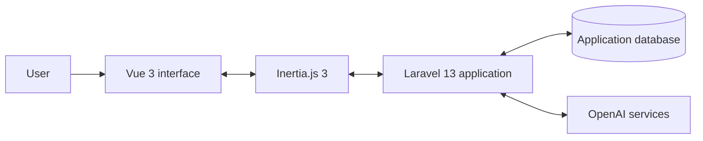

# FLOW

### AI-Powered Career Platform for Job Seekers and Employers

[Live Demo](https://jobflow.qurandeep.com) · [Source Code](https://github.com/diana-radchenko/FlowAI)

## Overview

FLOW is an educational technology project designed to connect career development and human-resource management in one system. It consists of two planned modules:

- **JobFlow** supports job seekers with resumes, vacancies, applications, AI evaluation, and interview practice.
- **HRFlow** is the planned employer module for vacancy publishing, candidate review, recruitment, onboarding, training, performance management, and retention.

The current repository implements **JobFlow**. HRFlow is part of the product vision. Development began in March 2026.

## Current JobFlow Functionality

| Area | What the current repository does |
|---|---|
| **Accounts and security** | Supports registration, login, password recovery, password changes, two-factor authentication, protected pages, appearance settings, and account deletion. Passwords are stored as hashes, and access to resumes and other private records is checked on the server. |
| **Resume management** | Creates, renames, duplicates, edits, and deletes multiple resumes. Users can reuse saved career records in different resume versions. |
| **Structured Resume Editor** | Stores personal and contact details, work experience, education, skills, projects, achievements, research, volunteer and community experience, leadership and extracurricular activities, languages, certifications, interests, and additional information. Each record can be added, updated, removed, selected, and reordered separately. |
| **AI Resume Assistant** | Builds or improves a selected resume through a guided conversation. It asks focused questions and uses eight controlled tools to save answers in the correct sections. Each resume has its own conversation history, so the user can continue later. |
| **General AI Resume Analysis** | Reviews a selected saved resume and returns strengths, weaknesses, practical recommendations, and a first-person Professional Summary based on the user's real information. |
| **AI Resume Scoring** | Compares a selected resume with a job description and returns a score from 0 to 100, a summary, strengths, and suggested additions or removals. 
| **Job Selection** | Displays vacancies stored in the JobFlow database, filters them by location and minimum salary, opens job details, and allows an authenticated user to apply. The database prevents duplicate applications to the same vacancy. |
| **Request Tracker** | Displays the user's submitted applications, application dates, and stored statuses. The user can open the related vacancy or remove an application. |
| **AI Interview Practice** | Lets the user select a resume, an optional applied vacancy, interview type, and difficulty. In live mode, the system transcribes an English voice answer, asks the next question, gives feedback, speaks the AI response, saves the conversation, and produces a final evaluation. |
| **Dashboard and schedule** | Shows real stored applications and provides sorting and filtering. The calendar displays saved interview sessions by date; it is not yet a full meeting-booking system. |
| **Settings and logout** | Updates profile and security settings and securely ends the authenticated session. The Support link is currently a placeholder. |

## AI System

JobFlow uses **OpenAI GPT-4o** through the Laravel AI SDK. The API key remains on the server and is not sent to the browser.

The AI functionality is divided into separate agents because each task needs different instructions and data:

- **Resume Builder Agent** collects career information and may save it only through eight predefined tools. This prevents the model from receiving unrestricted database access.
- **Resume Analysis Agent** evaluates the overall quality of a selected resume and generates improvement advice and a Professional Summary.
- **Resume Score Agent** compares resume evidence with a supplied job description and returns structured scoring feedback.
- **Interview Agent** uses the selected resume and optional applied vacancy to personalize questions, feedback, and the final evaluation.

For live interviews, OpenAI services are also used for speech transcription and audio generation. The current evaluation analyzes the content of an answer; it does not perform genuine acoustic analysis of tone, pauses, or confidence.

## Technical Architecture

JobFlow is a **modular monolithic web application**. The frontend and backend are organized into separate functional modules but are developed and deployed as one system. This choice keeps the project easier to build, test, and maintain than a group of independent microservices, while still allowing individual modules to be separated later if the platform grows.



- **Backend:** PHP 8.4, Laravel 13, Laravel Fortify, Laravel AI, Eloquent ORM.
- **Frontend:** Vue 3, TypeScript, Tailwind CSS 4, Reka UI, Lucide icons.
- **Application bridge:** Inertia.js 3 connects Vue pages to Laravel routes without requiring a separate REST API for most screens.
- **Build tools:** Vite 8, npm, Composer.
- **Database:** selected through environment variables; SQLite is the default local configuration. Models, relationships, foreign keys, unique constraints, and indexes protect data integrity.
- **Deployment:** Docker, Nginx, PHP-FPM, Supervisor, Nixpacks, and Coolify.
- **Testing and quality:** Pest, Laravel Pint, ESLint, Prettier, TypeScript validation, and GitHub Actions.

## Project Structure

```text
app/Ai/                  AI agents and controlled resume tools
app/Http/Controllers/    Request handling and application workflows
app/Models/              Database models and relationships
database/migrations/     Database structure and constraints
resources/js/pages/      Vue pages for each JobFlow section
routes/                  Authentication and application routes
tests/                   Pest unit and feature tests
```
## Current Prototype Boundaries

The following parts are visible in the interface but are not yet complete production functions:

- **HRFlow:** employer accounts and employer-side vacancy management have not been implemented.
- **Dashboard recommendations:** the recommended job cards are predefined demonstration records, although resume scoring on those cards uses GPT-4o.
- **Salary:** calculations, role comparisons, and resume-upload results are predefined in the frontend and are not connected to saved resumes, real vacancies, OpenAI, or external market data.
- **Development resources:** articles and audiobooks are selected manually; AI does not search, verify, or update them automatically.
- **Schedule:** displays interview sessions but does not yet create meetings or synchronize with external calendars.
- **Support:** the sidebar link does not yet open a support workflow.

## Next Development Priorities

- Build HRFlow employer accounts and a verified vacancy-publishing workflow.
- Connect one complete route from an employer vacancy to a selected JobFlow resume, application, tracker, and interview.
- Replace remaining demonstration data with stored records and connect Salary to vacancies published on the platform and verified market information.
- Save AI scores and scoring history in the database.
- Expand scheduling and add optional calendar integrations.
- Complete privacy, backup, monitoring, accessibility, and data-recovery procedures 
in the following academic year.

**Location:** Moscow, Russia  
**Live version:** [jobflow.qurandeep.com](https://jobflow.qurandeep.com)  
