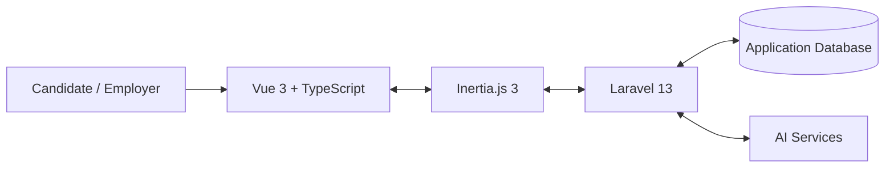

# FLOW

### AI-Powered Career Platform for Job Seekers and Employers

FLOW is a full-stack project I started developing in March 2026. I wanted to build a platform that connects both sides of the hiring process instead of treating them as completely separate systems.

A job seeker may create a resume on one website, search for vacancies on another, prepare for interviews somewhere else, and then track applications manually. Employers also have their own separate process for publishing vacancies, reviewing candidates, communicating with applicants, and scheduling interviews.

My idea was to bring these steps into one connected platform.

FLOW currently has two main modules:

- **JobFlow** — the candidate side, with resume management, job search, applications, job matching, interview practice, salary tools, development resources, and account settings.
- **HRFlow** — the employer side, with vacancy management, candidate applications, communication, and interview scheduling.

The current interface is in **English**.

## Why I Built FLOW

The original idea started from the job-seeker side. I wanted to make the job-search process more organized and less fragmented, especially for students and young applicants who may not have much formal work experience yet.

While developing JobFlow, I realized that applications do not exist only on the candidate's side. Every application also needs an employer who publishes the vacancy, reviews the candidate, changes the application status, communicates with the applicant, and possibly schedules an interview. This is why I started developing HRFlow as the second part of the same platform.

I do not want FLOW to replace recruiters or make important career decisions instead of people. My goal is to use software and AI where they are useful: organizing information, comparing evidence, helping users prepare, and making the recruitment process easier to follow.

## JobFlow — Candidate Side

### Dashboard

The dashboard gives the user a quick overview of their activity and provides shortcuts to the main parts of JobFlow.

### Resume Management

Users can create several resumes, rename them, duplicate them, delete them, and choose one as the **Primary Resume**. The Primary Resume becomes the default context for vacancy matching.

The structured Resume Editor supports:

- personal and contact information;
- work experience;
- education;
- skills;
- projects;
- volunteer and community experience;
- leadership and extracurricular activities;
- publications;
- awards and honors;
- languages;
- certifications;
- interests;
- additional information.

Resume records can also be included, excluded, and reordered for different resume versions. This means a user can reuse the same experience but create resumes for different types of jobs.

### AI Resume Assistant

The AI Resume Assistant works with a selected resume through a guided conversation. It can ask questions, help improve the content, and save information into the correct resume sections through controlled tools.

I chose controlled tools instead of giving the AI unrestricted access to the database. This makes the workflow more predictable and limits what the AI is allowed to change.

Each resume also has its own context, so information from different resume versions is not mixed together.

### AI Resume Analysis

The platform can analyze a saved resume and return:

- strengths;
- weaknesses;
- practical recommendations;
- suggestions for a professional summary.

### AI Resume Scoring

A user can compare a resume with a job description. The system returns structured feedback and a score showing how well the resume fits the supplied description.

## Job Selection

The Job Selection page shows published vacancies stored in the platform database.

Users can filter jobs by:

- keyword;
- company;
- industry;
- position level;
- employment type;
- location;
- work arrangement;
- minimum and maximum salary;
- date posted.

There are three main views:

- **All Jobs**;
- **Saved**;
- **Applied**.

Vacancies can also be sorted by publication date or salary.

### Saved Jobs

Users can save and unsave vacancies. Saved jobs belong to the authenticated user, so each account has its own list.

### Job Match

One of the parts I worked on most carefully was **Job Match**. I did not want to show a percentage without explaining where it came from.

The platform compares a vacancy with the user's Primary Resume using four criteria:

| Criterion | Weight |
|---|---:|
| Skills | 45% |
| Role relevance | 30% |
| Experience | 15% |
| Education | 10% |

**Skills** are compared with structured vacancy technologies when the employer provides them. When structured technologies are not available, the system looks for positive skill evidence in the vacancy text. I also added normalization for common variations such as `Python Programming` and `Python`, while avoiding false matches such as `Java` and `JavaScript`.

**Role relevance** compares the vacancy title with role-related information from the resume.

**Experience** can use formal work experience, but it can also use relevant projects, leadership activities, and volunteer experience. I think this is especially important for students because useful experience does not always come from a full-time job.

**Education** is used when the vacancy actually contains an education requirement. The algorithm can check degree level and relevant fields of study. If the employer does not mention education, the interface shows **N/A** instead of treating missing requirements as a candidate weakness.

The user can open **Why this matches** and see the separate criteria. This makes the result easier to understand and also makes the algorithm easier for me to test and improve.

## Applications and Tracker

Candidates can open a vacancy and apply using one of their own resumes. The platform checks resume ownership on the server and prevents duplicate applications to the same vacancy.

The Application Tracker shows submitted applications, dates, and stored statuses, so the candidate can follow the process in one place.

## Candidate–Employer Chat

Candidates and employers can communicate through an authenticated chat connected to a job application. I wanted communication to stay connected to the vacancy instead of becoming a separate unrelated message system.

## AI Interview Practice

The Interview section lets users practice using a selected resume and, when needed, a vacancy as context.

The workflow can include:

- AI-generated questions;
- voice-answer transcription;
- feedback;
- audio responses;
- saved interview sessions;
- final results and evaluation.

The current system evaluates the information available in the answer. It is not a biometric or psychological assessment and does not claim to identify personality from a person's voice.

## Salary and Development

JobFlow also includes a Salary section with resume salary analysis support and a Development section with curated learning resources.

## Support and Account Settings

The Support Center gives users direct access to real account functions:

- Change password;
- Two-factor authentication;
- Profile settings;
- Appearance.

I decided not to show a support-ticket form until there is a real support backend behind it. I prefer a smaller working feature to a button that only looks functional.

## HRFlow — Employer Side

HRFlow is the employer side of the same FLOW system.

At the current stage, employers can:

- create vacancies;
- view vacancies;
- edit vacancies;
- delete vacancies;
- review candidate applications;
- update application status;
- schedule interviews;
- remove interview schedules;
- communicate with candidates through chat.

Employer routes are protected separately from candidate routes, and application routes are scoped to their parent vacancy.

HRFlow is still developing. Onboarding, training, performance management, workforce analytics, and retention are possible future directions, but I do not present them as completed features.

## How I Use AI in the Project

I did not want to add AI to every feature just because it was possible. I tried to separate tasks where generative AI is useful from tasks where a normal algorithm is easier to explain and test.

The main AI-assisted workflows are:

- **Resume Assistant** — helps collect and improve resume information;
- **Resume Analysis** — gives feedback on a saved resume;
- **Resume Scoring** — compares a resume with a job description;
- **Resume Salary Analysis** — supports salary-related analysis;
- **Interview workflows** — generate questions, process answers, and provide feedback.

AI requests are handled on the server, so provider credentials are not exposed to the browser.

Job Match is different. I chose a deterministic scoring approach for it because I wanted users to see why a vacancy received a certain score. It is also easier to reproduce the result and write regression tests for specific matching rules.

## Why I Chose This Architecture

FLOW is built as a **modular monolith**.

I considered the fact that the platform contains many different areas: resumes, vacancies, applications, chat, interviews, salary tools, candidate functions, and employer functions. However, splitting a project of this size into separate microservices would make development, deployment, authentication, and testing much more complicated without giving enough benefit at this stage.

Instead, I keep the modules logically separated through controllers, services, models, routes, and Vue pages, while deploying them as one application. If the platform becomes much larger later, individual modules could be separated when there is a real reason to do it.



### Main Technologies

- **Backend:** PHP 8.4, Laravel 13, Laravel Fortify, Laravel AI, Laravel Wayfinder, Eloquent ORM, Spatie Laravel Permission.
- **Frontend:** Vue 3.5, TypeScript, Inertia.js 3, Tailwind CSS 4, Reka UI, Lucide icons, VueUse.
- **Build tools:** Vite 8, npm, Composer.
- **Database:** configured through environment settings; SQLite is supported for local development.
- **Deployment:** Docker-based deployment on a VPS.
- **Testing and code quality:** Pest, Laravel Pint, ESLint, Prettier, Vue TypeScript checks, and Playwright tooling.

## Security

Security became more important as the project grew from a prototype into a platform with different user roles and private data.

Some of the rules implemented in the project are:

- candidate and employer routes have separate role protection;
- users can apply only with resumes that belong to their own account;
- saved jobs and applications are connected to the authenticated user;
- employer application routes use scoped bindings so an application cannot be opened through the wrong vacancy;
- password changes use the Laravel/Fortify security workflow;
- two-factor authentication and recovery codes are available in Security settings;
- AI provider credentials stay on the server.

## Project Structure

```text
app/Ai/                       AI agents and controlled tools
app/Http/Controllers/         Candidate and shared application workflows
app/Http/Controllers/Employer Employer workflows
app/Http/Requests/            Request validation
app/Models/                   Database models and relationships
app/Services/                 Matching and domain logic
database/migrations/          Database schema
resources/js/components/      Shared Vue components
resources/js/pages/           Candidate, employer, settings and support pages
routes/                       Application and settings routes
tests/                        Pest and feature tests
```

## Testing and Debugging

Testing this project has also been an important part of development. Some bugs were not visible from the interface alone. For example, filters can look correct but fail because of request validation, URL state, or backend query logic. Matching algorithms can also produce reasonable-looking percentages while using the wrong comparison rule.

Because of this, I use both automated tests and manual browser/VPS validation.

Useful project checks include:

```bash
composer test
npm run lint:check
npm run format:check
npm run types:check
npm run build
npm run test:e2e
```

For important changes, I also compare the deployed VPS version with the GitHub branch before merging it into `main`.

## Current Limitations

I think it is important to separate what the project really does from what I may build later.

- HRFlow currently focuses on recruitment and is not a complete HR information system.
- Job Match is an explainable matching model, not a perfect prediction of whether someone will get a job.
- Interview evaluation works with the available answer content and is not a psychological assessment.
- Development resources are curated rather than automatically searched and verified by AI.
- External calendar synchronization is not presented as implemented unless it is actually connected and tested.
- The Support Center links to real account settings, but there is no support-ticket system yet.
- The interface is currently English-only.

## What I Learned

FLOW started as an idea about improving the job-search process, but it became a much larger engineering project than I expected.

While working on it, I learned that building a real web application is not only about making pages look good. I had to work with database relationships, authentication, authorization, user roles, request validation, frontend state, backend queries, AI integration, testing, deployment, and debugging problems that involved several parts of the system at the same time.

I also learned to be more careful about AI features. A result can look impressive but still be difficult to explain or test. This is one reason why I kept Job Match deterministic and used generative AI only for workflows where it adds something useful.

Another important lesson was that a feature is not finished just because the code exists. It also has to work with real data, survive different user cases, and behave correctly after deployment.

## What I Want to Improve Next

My next priorities are:

1. continue testing and improving Job Match with more real resume/vacancy combinations;
2. develop HRFlow beyond the recruitment stage;
3. add more automated tests for important candidate and employer flows;
4. improve scheduling and calendar functions;
5. continue working on privacy, backups, accessibility, monitoring, and recovery.

## Project Information

**Project:** FLOW  
**Candidate module:** JobFlow  
**Employer module:** HRFlow  
**Development started:** March 2026  
**Current UI language:** English  
**Repository:** `diana-radchenko/JobFlow`
