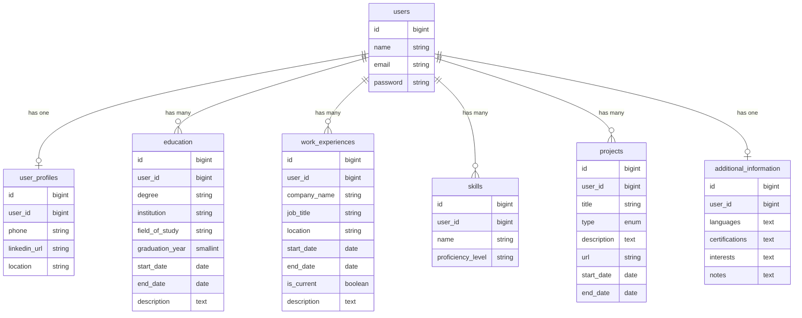

# Resume Database Architecture

## Existing users table

Already has `name`, `email`, `password` — no duplication needed in profile.

## Tables & Migrations

### 1. `user_profiles` — one-to-one with users

`create_user_profiles_table`

- `user_id` — foreignId, unique, cascadeOnDelete
- `phone` — string, nullable
- `linkedin_url` — string, nullable
- `location` — string, nullable (e.g. "Warsaw, Poland")

---

### 2. `education` — one-to-many with users (optional rows)

`create_education_table`

- `user_id` — foreignId, cascadeOnDelete
- `degree` — enum : HIGHSCHOOL
CERTIFICATE
ASSOCIATE
BACHELORS
MASTERS
DOCTORATE
POSTDOC
- `institution` — string
- `field_of_study` — string, nullable
- `start_date` — date, nullable
- `end_date` — date, nullable
- `description` — text, nullable

---

### 3. `work_experiences` — one-to-many with users

`create_work_experiences_table`

- `user_id` — foreignId, cascadeOnDelete
- `company_name` — string
- `job_title` — string
- `location` — string, nullable
- `start_date` — date
- `end_date` — date, nullable (null = currently employed)
- `is_current` — boolean, default false
- `description` — text, nullable

---

### 4. `skills` — one-to-many with users (optional rows)

`create_skills_table`

- `user_id` — foreignId, cascadeOnDelete
- `name` — string
- `proficiency_level` — enum (Beginner / Intermediate / Advanced / Expert)

---

### 5. `projects` — one-to-many with users (covers achievements too)

`create_projects_table`

- `user_id` — foreignId, cascadeOnDelete
- `title` — string
- `type` — enum: `project`, `achievement`
- `description` — text, nullable
- `url` — string, nullable
- `start_date` — date, nullable
- `end_date` — date, nullable

---

### 6. `additional_information` — one-to-one with users (optional)

`create_additional_information_table`

- `user_id` — foreignId, unique, cascadeOnDelete
- `languages` — text, nullable
- `certifications` — text, nullable
- `interests` — text, nullable
- `notes` — text, nullable (free-form extra info)

---

## Relationship Diagram

